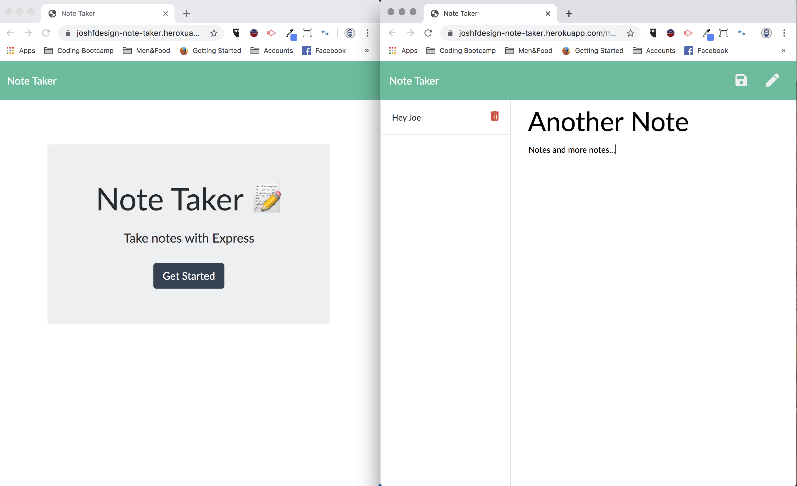

# Note-Taker
Assignment for UofT SCS Coding Bootcamp
Week 11

# Directions for the project

The goal of the project was to build a backend server.js that connects the front-end to the other backend components. To achieve this, the server.js fie had to;

- create HTML routes using GET functions for "/notes" and "/".

- create API routes to;
    - GET "/API/notes" => read the db.json file.
    - POST "/API/notes" => update the db.json file with new notes.
    - DELETE "/API/notes/:id" => through unique ids, delete specific notes from the db.json file.

# Deployment
    
Heroku
https://joshfdesign-note-taker.herokuapp.com/

GitHub repo
https://github.com/TwistedPixels/Note-Taker.git

# Usage

From the Landing page, press "Get Started" to go to the Notes page.

From the Notes page, if notes already are contained in the JSON database, the user can;
- View previous notes (displayed on the lefthand side).
- Delete previous notes (by clicking the trash can icon for the corresponding note).
- Create a new note (by clicking the pencil icon on the top right).
- Save a current note (by clicking the save icon on the top right, which will only appear once the title and text fields contain something).

If there are no previous notes, user can only Save a current note.

*** There is lag with the server, so the user may have to refresh the page to properly see that a note is saved or deleted.**

# License

MIT License

Copyright (c) 2019 Josh

Permission is hereby granted, free of charge, to any person obtaining a copy
of this software and associated documentation files (the "Software"), to deal
in the Software without restriction, including without limitation the rights
to use, copy, modify, merge, publish, distribute, sublicense, and/or sell
copies of the Software, and to permit persons to whom the Software is
furnished to do so, subject to the following conditions:

The above copyright notice and this permission notice shall be included in all
copies or substantial portions of the Software.

THE SOFTWARE IS PROVIDED "AS IS", WITHOUT WARRANTY OF ANY KIND, EXPRESS OR
IMPLIED, INCLUDING BUT NOT LIMITED TO THE WARRANTIES OF MERCHANTABILITY,
FITNESS FOR A PARTICULAR PURPOSE AND NONINFRINGEMENT. IN NO EVENT SHALL THE
AUTHORS OR COPYRIGHT HOLDERS BE LIABLE FOR ANY CLAIM, DAMAGES OR OTHER
LIABILITY, WHETHER IN AN ACTION OF CONTRACT, TORT OR OTHERWISE, ARISING FROM,
OUT OF OR IN CONNECTION WITH THE SOFTWARE OR THE USE OR OTHER DEALINGS IN THE
SOFTWARE.
